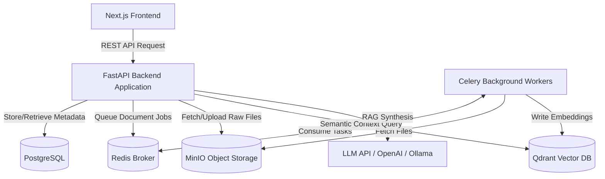

# MemoryOS

MemoryOS is a robust, production-grade, AI-powered personal knowledge vault designed to enable RAG (Retrieval-Augmented Generation)-based semantic search and natural language chat over user-uploaded documents. By indexing unstructured text and files into a high-performance vector space, MemoryOS allows individuals to converse with their documents, search through complex notes, and query personal data securely and contextually.

The project features a high-performance **FastAPI backend** managing database models, vector stores, and processing workers, paired with a modern **Next.js frontend** serving a secure workspace interface.

---

## 🛠️ Tech Stack

MemoryOS is built using a modern full-stack web architecture optimized for fast text ingestion, high-concurrency vector search, and scalable document storage:

### Frontend
*   **Next.js (v16.3 App Router)**: React framework with optimized file routing, server-side caching, and build optimizations.
*   **React (v19)**: Modern user interface component development.
*   **Tailwind CSS (v4)**: High-performance utility styling and CSS theme compilation.
*   **TypeScript**: Static analysis type safety.
*   **JWT Client Session Manager**: Memory-based token variables paired with silent refresh handling against localStorage.

### Backend & Infrastructure
*   **FastAPI**: Async Python web framework for building high-performance, developer-friendly REST APIs.
*   **PostgreSQL**: Relational database for storing user accounts, document metadata, logs, and access controls.
*   **SQLAlchemy & Alembic**: Object Relational Mapper (ORM) for SQL integration and database schema migrations.
*   **Qdrant**: Vector database hosting high-dimensional embeddings for fast, semantic-based chunk retrieval.
*   **MinIO**: S3-compatible object storage server to securely store and serve user-uploaded raw documents (PDFs, TXT, DOCX).
*   **Redis**: In-memory data store for API caching, task queues, and rate-limiting.
*   **Celery**: Background workers for handling heavy lifting asynchronously (such as document text extraction and embedding generation).
*   **Pydantic (v2)**: Advanced data validation and environment settings management.

---

## 🏗️ Architecture Overview

The application is structured as a collection of decoupled services:



*   **Next.js Frontend (Port 3000)**: Serves landing pages, register/login forms, the secure dashboard shell, and file upload dropzones.
*   **FastAPI Application (Port 8000)**: Serves endpoints, manages user sessions/auth, and handles search/RAG queries.
*   **PostgreSQL (Relational Store)**: Maintains tables for `users`, `documents`, and `chat_sessions`.
*   **MinIO (File Storage)**: Acts as the primary object vault. Uploaded documents are saved here with unique UUID paths.
*   **Celery & Redis (Task Pipeline)**: When a document is uploaded, FastAPI schedules a background job. The worker extracts text chunks, computes embedding vectors, and pushes them to Qdrant.
*   **Qdrant (Vector Engine)**: Indexes text chunks with their associated document IDs, allowing for semantic search filtering per user.
*   **LLM Service**: Connects to external APIs (OpenAI) or local runners (Ollama) to synthesise final RAG answers based on search snippets.

---

## 📋 Prerequisites

Before initiating the setup process, ensure you have the following installed locally:

1.  **Docker & Docker Compose**:
    *   Docker Engine: `v20.10+`
    *   Docker Compose: `v2.0+`
2.  **Node.js**:
    *   Version: `v18.0.0+`
    *   Package Manager: `npm v9.0.0+`
3.  **Git**: For version control.
4.  **Python 3.11+** *(Optional)*: Only required if running the FastAPI application locally without containers.

---

## 🚀 Setup Instructions

Follow these step-by-step instructions to get both frontend and backend running locally:

### 1. Clone the Repository
```bash
git clone https://github.com/Saravana65/MemoryOS.git
cd MemoryOS
```

### 2. Configure Environment Variables
Copy the templates to their local configuration locations:
*   **Backend Environment Variables**:
    ```bash
    cp .env.example .env
    ```
    Open `.env` and verify credentials. At minimum, supply a valid `OPENAI_API_KEY`.
*   **Frontend Environment Variables**:
    ```bash
    cp .env.local.example .env.local
    ```
    Verify that `NEXT_PUBLIC_API_URL` points to the local backend address (`http://localhost:8000`).

### 3. Spin Up Infrastructure
Launch all required backend infrastructure services (Postgres, Redis, Qdrant, MinIO) in detached mode:
```bash
docker compose up -d
```

### 4. Run Alembic Database Migrations
Initialize database tables by running the Alembic migration history:
```bash
docker compose exec backend alembic upgrade head
```

### 5. Launch the Next.js Frontend
Install the client packages and start the frontend development server:
```bash
npm install
npm run dev
```
The client dashboard interface will be accessible at [http://localhost:3000](http://localhost:3000).

---

## 📡 API Documentation

Interactive endpoint documentation is served at `/docs` (Swagger UI) when the backend application is running.

### Summary of Planned Endpoints

| Method | Path | Description | Authentication Required |
| :--- | :--- | :--- | :---: |
| `GET` | `/health` | Health and service readiness check. | ❌ No |
| `POST` | `/api/v1/auth/register` | Register a new user account. | ❌ No |
| `POST` | `/api/v1/auth/login` | Login to retrieve access and refresh tokens. | ❌ No |
| `POST` | `/api/v1/auth/refresh` | Refresh an expired access token. | ❌ No |
| `POST` | `/api/v1/auth/logout` | Revoke a session refresh token. | ❌ No |
| `GET` | `/api/v1/auth/me` | Fetch authenticated user information. |  Yes |
| `POST` | `/api/v1/files/upload` | Upload a file to object storage and trigger ingest. |  Yes |
| `GET` | `/api/v1/files` | Retrieve list of uploaded files metadata. |  Yes |
| `DELETE` | `/api/v1/files/{id}` | Delete a document and its vector embeddings. |  Yes |
| `POST` | `/api/v1/search` | Search indexed documents semantic snippets. |  Yes |
| `POST` | `/api/v1/chat` | Chat with your documents using RAG. |  Yes |

---

### Curl Examples

#### 1. Health Check
*   **Request**:
    ```bash
    curl -X GET "http://localhost:8000/health"
    ```
*   **Response**:
    ```json
    {
      "status": "healthy",
      "timestamp": "2026-08-07T12:00:00Z",
      "services": {
        "postgres": "online",
        "redis": "online",
        "qdrant": "online",
        "minio": "online"
      }
    }
    ```

#### 2. User Registration
*   **Request**:
    ```bash
    curl -X POST "http://localhost:8000/api/v1/auth/register" \
         -H "Content-Type: application/json" \
         -d '{"email": "user@example.com", "password": "secure_password_123", "full_name": "John Doe"}'
    ```
*   **Response**:
    ```json
    {
      "id": "7a9df72e-c75c-4d3b-82ef-d71d87e07a3c",
      "email": "user@example.com",
      "full_name": "John Doe",
      "is_active": true,
      "created_at": "2026-08-07T12:05:00Z"
    }
    ```

#### 3. User Login
*   **Request**:
    ```bash
    curl -X POST "http://localhost:8000/api/v1/auth/login" \
         -H "Content-Type: application/json" \
         -d '{"email": "user@example.com", "password": "secure_password_123"}'
    ```
*   **Response**:
    ```json
    {
      "access_token": "eyJhbGciOiJIUzI1NiIsInR5cCI6IkpXVCJ9...",
      "refresh_token": "d71d87e07a3c-4d3b-82ef-7a9df72e...",
      "token_type": "bearer"
    }
    ```

#### 4. Upload Document
*   **Request**:
    ```bash
    curl -X POST "http://localhost:8000/api/v1/files/upload" \
         -H "Authorization: Bearer <your_access_token>" \
         -F "file=@/path/to/handbook.pdf"
    ```
*   **Response**:
    ```json
    {
      "id": "cfb42e61-a083-4a67-8e6d-74d32f5f190e",
      "filename": "handbook.pdf",
      "file_size_bytes": 245312,
      "status": "pending",
      "created_at": "2026-08-07T12:10:00Z"
    }
    ```

#### 5. List Documents
*   **Request**:
    ```bash
    curl -X GET "http://localhost:8000/api/v1/files?page=1&page_size=20" \
         -H "Authorization: Bearer <your_access_token>"
    ```
*   **Response**:
    ```json
    {
      "items": [
        {
          "id": "cfb42e61-a083-4a67-8e6d-74d32f5f190e",
          "filename": "handbook.pdf",
          "file_size_bytes": 245312,
          "status": "completed",
          "created_at": "2026-08-07T12:10:00Z"
        }
      ],
      "total": 1,
      "page": 1,
      "page_size": 20,
      "pages": 1
    }
    ```

#### 6. Delete Document
*   **Request**:
    ```bash
    curl -X DELETE "http://localhost:8000/api/v1/files/cfb42e61-a083-4a67-8e6d-74d32f5f190e" \
         -H "Authorization: Bearer <your_access_token>"
    ```
*   **Response**:
    ```json
    {
      "status": "success",
      "message": "File and associated vector records deleted"
    }
    ```

---

## 📂 Project Structure

```
MemoryOS/
├── app/                  # Next.js App Router folders
│   ├── (app)/            # Authenticated layout group (/dashboard, /upload)
│   ├── (auth)/           # Authentication route pages (/login, /register)
│   ├── (marketing)/      # Public marketing landing pages (/)
│   ├── globals.css       # Tailwind CSS import declarations
│   └── layout.tsx        # HTML wrapping and Auth Context mounting
├── components/           # UI Elements
│   ├── layout/           # Shared interface wrappers (Navbar, Sidebar)
│   ├── ui/               # Presentation elements (Button, Input, Card)
│   └── upload/           # Upload interfaces (DropZone, FileList, UploadQueue)
├── lib/                  # Core modules
│   ├── api/              # Fetch adapters mapping backend schemas (client, auth, files)
│   ├── auth/             # Hooks checking session authentication status (AuthContext, useAuth)
│   └── types/            # TypeScript models (user, document)
├── public/               # Shared static visual assets
├── middleware.ts         # Server-side routing interceptor for session redirection
├── next.config.js        # Next.js configurations
├── tailwind.config.ts    # Tailwind config bindings
├── tsconfig.json         # TypeScript compiler configurations
├── package.json          # Dependency packages definitions
├── .env.local.example    # Frontend environment config template
├── .env.example          # Backend infrastructure config template
└── README.md             # Project documentation
```

---

## ⚙️ Environment Variables Reference

### Frontend Configuration (`.env.local`)
| Variable Name | Required? | Description | Example Value |
| :--- | :---: | :--- | :--- |
| `NEXT_PUBLIC_API_URL` | **Yes** | Root endpoint pointing to the FastAPI API gateway. | `http://localhost:8000` |

### Backend Infrastructure (`.env`)
| Variable Name | Required? | Description | Example Value |
| :--- | :---: | :--- | :--- |
| `PROJECT_NAME` | Optional | Descriptive title of the application instance. | `"MemoryOS Backend"` |
| `DEBUG` | Optional | Set to `true` to enable autoreload and stack trace logs. | `true` |
| `SECRET_KEY` | **Yes** | Cryptographic key used to sign JWT authentication tokens. | `some_random_hex_string` |
| `DATABASE_URL` | **Yes** | Connection string for the PostgreSQL service database. | `postgresql://postgres:postgres@db:5432/memoryos` |
| `REDIS_URL` | **Yes** | Connection string for the Redis cache / Celery broker. | `redis://redis:6379/0` |
| `QDRANT_HOST` | **Yes** | Hostname of the Qdrant vector database. | `qdrant` |
| `QDRANT_PORT` | Optional | Port numbers for connecting to Qdrant. | `6333` |
| `QDRANT_COLLECTION_NAME`| Optional | Vector storage collection name where chunks are stored. | `memoryos_documents` |
| `MINIO_ENDPOINT` | **Yes** | Host and port pointing to the MinIO API server. | `minio:9000` |
| `MINIO_ACCESS_KEY` | **Yes** | Admin access username for MinIO bucket access. | `minioadmin` |
| `MINIO_SECRET_KEY` | **Yes** | Admin secret password for MinIO bucket access. | `minioadmin` |
| `MINIO_SECURE` | Optional | Toggle HTTPS protocols for MinIO connections. | `false` |
| `MINIO_BUCKET_NAME` | Optional | Default bucket identifier for storing documents. | `memoryos-documents` |
| `OPENAI_API_KEY` | **Yes** | Secret API credential for calling LLM and Embeddings API. | `sk-proj-LLM123...` |
| `EMBEDDING_MODEL` | Optional | Text representation embedding model type. | `text-embedding-3-small` |
| `LLM_MODEL` | Optional | Base LLM to synthesize final responses. | `gpt-4o-mini` |

---

## 🧪 Running Tests

Tests not yet added

---

## 🗺️ Development Roadmap / Current Status

### Currently Implemented
*   **Frontend Shell**: Bootstrapped Next.js 16 (React 19) app containing layouts and styling config (Tailwind v4).
*   **User Session Handlers**: Built JWT token management (AuthContext + localStorage) mapped with server-side redirects in `middleware.ts`.
*   **File Upload Interfaces**: Built drag-and-drop dropzones with size and file type restrictions, progressive upload queue, and paginated document catalog.
*   **Infrastructure Design**: Fully specified system interactions and service bounds using Docker Compose configuration mappings.

### Upcoming Milestones
1.  **Core Application & DB**: Write the core FastAPI application setup, instantiate SQLAlchemy connection systems, and initialize Alembic models.
2.  **File Ingest Pipelines**: Implement S3 file retrieval systems with MinIO and Celery text partitioning tasks.
3.  **Embeddings & Similarity Search**: Connect Qdrant database clients, write text chunking algorithms, and build similarity lookup services.
4.  **RAG Chat Logic**: Implement semantic query synthesis models leveraging OpenAI APIs and configure conversational database tracking.
